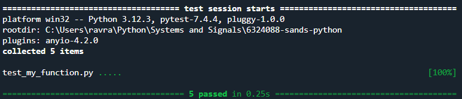

# Signals and Systems practical
## Introduction
This repository was made for the python part of the course Signals and Systems and 
contains scripts to create, modify and plot signals in python.
This will be done using multiple files and modules, where we use different 
modules with functions which will be used in different python scripts.

## Contents
This repository contains the following files:
1. signals.py containing various functions that are mentioned below
    - Function ```generate_sine_wave(frequency, duration, sample_rate) ``` that generates a regular sine wave
    - Function ```u(start, finish, amplitude, sample_rate)``` which generates a regular unit step function
    - Function ```modified_sine_wave(frequency, duration, sample_rate, amplitude, Offset)``` which generates a sine wave with modified amplitude and offset
    - Function ```modified_u(start, finish, delay, amplitude, sample_rate)``` which generates a unit step function with a chosen delay
    - Function ```pulse(start, stop, amplitude, shift, length, sample_rate=1000)``` which generates a pulse function whose amplitude and length can be modified and which can be shifted
2. run.py which runs the above mentioned functions
3. test_my_function.py which uses pytest to test the funtions in signals.py
4. hello.py which was a test file to see if the repository was correctly linked and has no further use
5. test.py is a test file to see how assert worked, the real testing is done in test_my_function.py
6. pyproject.toml


## How to use
There are two main files, signals, which contains the functions and run, where 
we use and run these functions. Besides these two main files there is also test_my_functions, in which the functions get tested so that we can confirm that they work and that we can actually run them in the run file. From the signals file we import various functions
such as ```generate_sine_wave(frequency, duration, sample_rate) ``` and ```u(start, finish, amplitude, sample_rate)```
into the run file. All the functions of the signals file do use the numpy library so this will need to be imported. 
Using the functions from the signals file we then generate various signals in the run file and plot them using matplotlib.pyplot.
Below an example how we would use these funtions to plot a sine wave using ```generate_sine_wave(frequency, duration, sample_rate) ```

```
import signals as sig
import numpy as np
import matplotlib.pyplot as plt

t, y = sig.generate_sine_wave(2, 3, 100)
plt.figure()
plt.plot(t, y)
plt.title("Sine wave")
plt.xlabel("Time")
plt.ylabel("Amplitude")
plt.show()
```
Below the proof that tests were run and that all the functions now work as they are supposed to

